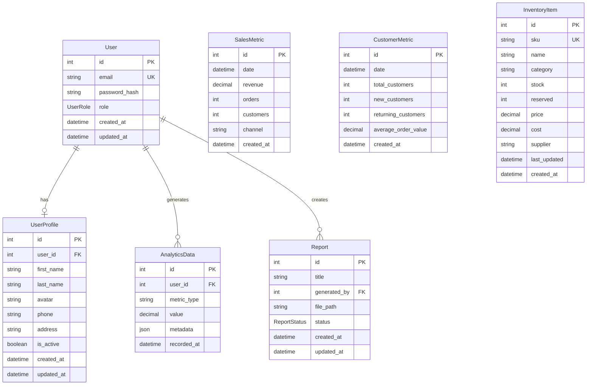

# E-Commerce System Architecture

## Overview

This document outlines the architecture of a comprehensive e-commerce management system consisting of three main components: a backend API, an admin panel for user management, and an analytics dashboard for business intelligence.

## System Components

### 🏗️ Architecture Diagram

```
┌─────────────────────────────────────────────────────────────────────────────────┐
│                           E-Commerce System Architecture                        │
└─────────────────────────────────────────────────────────────────────────────────┘

┌─────────────────┐    ┌─────────────────┐    ┌─────────────────────────────────┐
│   Admin Panel   │    │ E-Commerce      │    │         Backend API             │
│   (Vue.js)      │    │ Dashboard       │    │      (Express.js)              │
│                 │    │ (Next.js)       │    │                                 │
│ • User Mgmt     │◄──►│ • Analytics     │◄──►│ • Authentication                │
│ • Roles & Perms │    │ • Sales Reports │    │ • User Management               │
│ • Settings      │    │ • Inventory     │    │ • Analytics API                 │
│ • Dark/Light    │    │ • Customers     │    │ • File Upload                   │
│   Theme         │    │ • Real-time     │    │ • Reports & Export              │
│                 │    │   Updates       │    │ • Integrations                  │
└─────────────────┘    └─────────────────┘    └─────────────────────────────────┘
         │                       │                           │
         │                       │                           │
         └───────────────────────┼───────────────────────────┘
                                 │
                    ┌─────────────────────────────────┐
                    │        PostgreSQL Database      │
                    │                                 │
                    │ • Users & Profiles              │
                    │ • Analytics Data                │
                    │ • Sales Metrics                 │
                    │ • Customer Metrics              │
                    │ • Inventory Items               │
                    │ • Reports                       │
                    └─────────────────────────────────┘
```

---

## 📊 Entity Relationship Diagram (ERD)



---

## 🏛️ System Architecture

### Backend API (Express.js + TypeScript)

**Location**: `/backend`
**Port**: 4000
**Database**: PostgreSQL with Prisma ORM

#### Core Features:
- **Authentication & Authorization**: JWT-based auth with role-based access control
- **User Management**: CRUD operations for users and profiles
- **Analytics Engine**: Data collection and processing for business metrics
- **File Management**: Upload, storage, and deletion of files
- **Report Generation**: Export data in JSON/CSV formats
- **Integration Hub**: Webhook handling for external services
- **Real-time Updates**: WebSocket support for live data

#### Technology Stack:
```typescript
{
  "runtime": "Node.js 18+",
  "framework": "Express.js",
  "language": "TypeScript",
  "database": "PostgreSQL",
  "orm": "Prisma",
  "authentication": "JWT",
  "security": ["Helmet", "CORS", "Rate Limiting"],
  "validation": "express-validator",
  "fileUpload": "Multer",
  "logging": "Morgan"
}
```

#### API Structure:
```
/api
├── /auth          # Authentication endpoints
├── /users         # User management
├── /analytics     # Analytics data
├── /upload        # File operations
├── /reports       # Data export
├── /integrations  # External webhooks
└── /health        # System status
```

---

### Admin Panel (Vue.js + TypeScript)

**Location**: `/admin-panel`
**Port**: 5173
**Framework**: Vue 3 with Composition API

#### Primary Purpose:
Administrative interface for managing users, roles, permissions, and system settings.

#### Core Features:
- **User Management**: Create, read, update, delete users
- **Role & Permission Management**: Assign roles and manage permissions
- **Analytics Dashboard**: Basic analytics and user statistics
- **Settings Management**: System configuration and preferences
- **Theme Support**: Dark/Light mode with system preference detection
- **Export Functionality**: CSV export of user data
- **Real-time Updates**: Live user activity monitoring

#### Technology Stack:
```typescript
{
  "framework": "Vue.js 3",
  "language": "TypeScript",
  "stateManagement": "Pinia",
  "routing": "Vue Router",
  "styling": "Tailwind CSS",
  "formValidation": "VeeValidate + Yup",
  "charts": "Chart.js + Vue-ChartJS",
  "icons": "Lucide Vue",
  "httpClient": "Axios",
  "testing": "Vitest + Vue Test Utils",
  "buildTool": "Vite"
}
```

#### Component Architecture:
```
src/
├── components/
│   ├── auth/           # Authentication components
│   ├── users/          # User management components
│   ├── dashboard/      # Dashboard widgets
│   ├── layout/         # Layout components
│   └── ui/             # Reusable UI components
├── views/              # Page components
├── stores/             # Pinia stores
├── services/           # API services
├── types/              # TypeScript definitions
└── utils/              # Utility functions
```

#### Key Features:
- **Responsive Design**: Mobile-first approach with Tailwind CSS
- **Component Library**: Reusable UI components with consistent design
- **State Management**: Centralized state with Pinia stores
- **Form Validation**: Comprehensive validation with VeeValidate
- **Theme System**: Persistent theme preferences with system detection
- **Export System**: Client-side and server-side data export options

---

### E-Commerce Dashboard (Next.js + TypeScript)

**Location**: `/ecommerce-dashboard`
**Port**: 3000
**Framework**: Next.js 15 with App Router

#### Primary Purpose:
Analytics and business intelligence interface for e-commerce operations.

#### Core Features:
- **Sales Analytics**: Revenue tracking, order analysis, performance metrics
- **Customer Analytics**: Customer behavior, segmentation, lifetime value
- **Inventory Management**: Stock levels, product performance, supplier data
- **Real-time Dashboards**: Live updates via GraphQL subscriptions
- **Advanced Reporting**: Custom reports with filtering and export
- **Data Visualization**: Interactive charts and graphs

#### Technology Stack:
```typescript
{
  "framework": "Next.js 15",
  "language": "TypeScript",
  "stateManagement": "Redux Toolkit",
  "dataFetching": "TanStack Query + Apollo Client",
  "styling": "Tailwind CSS v4",
  "formHandling": "React Hook Form + Zod",
  "charts": "Chart.js + React-ChartJS-2",
  "realTime": "GraphQL Subscriptions + WebSockets",
  "testing": "Jest + React Testing Library + Cypress",
  "buildTool": "Turbopack"
}
```

#### Application Structure:
```
src/
├── app/                # Next.js App Router pages
│   ├── customers/      # Customer analytics
│   ├── inventory/      # Inventory management
│   ├── reports/        # Report generation
│   └── settings/       # Dashboard settings
├── components/
│   ├── charts/         # Chart components
│   ├── tables/         # Data table components
│   └── forms/          # Form components
├── graphql/            # GraphQL queries/mutations
├── hooks/              # Custom React hooks
├── lib/                # Utilities and configurations
└── utils/              # Helper functions
```

#### Key Features:
- **Server-Side Rendering**: Optimized performance with Next.js SSR
- **Real-time Data**: Live updates using GraphQL subscriptions
- **Advanced Analytics**: Complex data visualization and reporting
- **Performance Optimization**: Code splitting and lazy loading
- **Type Safety**: End-to-end TypeScript with Zod validation

---

## 🔄 Data Flow Architecture

### Authentication Flow
```
1. User Login Request → Backend API
2. Validate Credentials → Database
3. Generate JWT Token → Return to Client
4. Store Token → Frontend (localStorage)
5. Include Token → All Subsequent Requests
6. Validate Token → Middleware (Backend)
7. Grant/Deny Access → Based on Role
```

### User Management Flow
```
Admin Panel → API Request → Backend Validation → Database Operation → Response → UI Update
```

### Analytics Data Flow
```
E-commerce Events → Backend Processing → Database Storage → API Endpoints → Dashboard Visualization
```

### Real-time Updates Flow
```
Database Change → Backend Event → WebSocket/GraphQL Subscription → Frontend Update
```

---

## 🛡️ Security Architecture

### Authentication & Authorization
- **JWT Tokens**: Stateless authentication with configurable expiration
- **Role-Based Access Control (RBAC)**: Three-tier permission system
- **Password Security**: bcryptjs hashing with salt rounds
- **Token Refresh**: Automatic token renewal mechanism

### API Security
- **Rate Limiting**: 100 requests per 15 minutes per IP
- **CORS Protection**: Configurable cross-origin policies
- **Helmet Middleware**: Security headers protection
- **Input Validation**: Comprehensive request validation
- **SQL Injection Prevention**: Prisma ORM parameterized queries

### Frontend Security
- **XSS Protection**: Content Security Policy headers
- **CSRF Protection**: Token-based request validation
- **Secure Storage**: Encrypted localStorage for sensitive data
- **Route Protection**: Authentication guards on protected routes

---

## 📈 Scalability Considerations

### Database Optimization
- **Indexing Strategy**: Optimized indexes for frequent queries
- **Connection Pooling**: Efficient database connection management
- **Query Optimization**: Prisma query optimization and caching
- **Data Archiving**: Historical data management strategy

### Application Scaling
- **Horizontal Scaling**: Load balancer ready architecture
- **Caching Strategy**: Redis integration for session and data caching
- **CDN Integration**: Static asset delivery optimization
- **Microservices Ready**: Modular architecture for service separation

### Performance Optimization
- **Code Splitting**: Lazy loading for frontend applications
- **Image Optimization**: Next.js automatic image optimization
- **Bundle Optimization**: Tree shaking and minification
- **Database Queries**: Efficient query patterns and pagination

---

## 🔧 Development Workflow

### Environment Setup
```bash
# Backend
cd backend
npm install
cp env.example .env
npm run migrate
npm run seed
npm run dev

# Admin Panel
cd admin-panel
npm install
cp env.local.example .env.local
npm run dev

# E-commerce Dashboard
cd ecommerce-dashboard
npm install
cp env.local.example .env.local
npm run dev
```

### Testing Strategy
- **Unit Tests**: Component and function level testing
- **Integration Tests**: API endpoint testing
- **E2E Tests**: Full user workflow testing with Cypress
- **Performance Tests**: Load testing for API endpoints

### Deployment Architecture
```
Production Environment:
├── Backend API (Docker Container)
├── Admin Panel (Static Build - Nginx)
├── E-commerce Dashboard (Next.js - Vercel/Docker)
├── PostgreSQL Database (Managed Service)
├── Redis Cache (Managed Service)
└── File Storage (AWS S3/CloudFlare R2)
```

---

## 🌐 Integration Points

### External Services
- **Payment Processing**: Stripe webhook integration
- **Email Services**: SMTP/SendGrid integration
- **File Storage**: AWS S3 or CloudFlare R2
- **Analytics**: Google Analytics integration
- **Monitoring**: Application performance monitoring

### API Integrations
- **RESTful APIs**: Standard HTTP REST endpoints
- **GraphQL**: Advanced querying for dashboard
- **WebSockets**: Real-time data updates
- **Webhooks**: External service notifications

---

## 📊 Monitoring & Analytics

### Application Monitoring
- **Health Checks**: Automated system health monitoring
- **Error Tracking**: Comprehensive error logging and alerting
- **Performance Metrics**: Response time and throughput monitoring
- **User Analytics**: User behavior and engagement tracking

### Business Intelligence
- **Sales Metrics**: Revenue, orders, conversion rates
- **User Metrics**: Registration, activity, retention
- **System Metrics**: API usage, error rates, performance
- **Custom Reports**: Configurable business reports

---

## 🚀 Future Enhancements

### Planned Features
- **Multi-tenant Architecture**: Support for multiple organizations
- **Advanced Analytics**: Machine learning insights
- **Mobile Applications**: React Native mobile apps
- **API Gateway**: Centralized API management
- **Event Sourcing**: Event-driven architecture implementation

### Technology Upgrades
- **Database Sharding**: Horizontal database scaling
- **Microservices**: Service-oriented architecture
- **Container Orchestration**: Kubernetes deployment
- **Edge Computing**: CDN and edge function integration

---

## 📝 Documentation Standards

### Code Documentation
- **API Documentation**: OpenAPI/Swagger specifications
- **Component Documentation**: Storybook for UI components
- **Database Schema**: Prisma schema documentation
- **Architecture Decisions**: ADR (Architecture Decision Records)

### Deployment Documentation
- **Environment Setup**: Detailed setup instructions
- **Configuration Management**: Environment variable documentation
- **Deployment Procedures**: Step-by-step deployment guides
- **Troubleshooting**: Common issues and solutions

---


